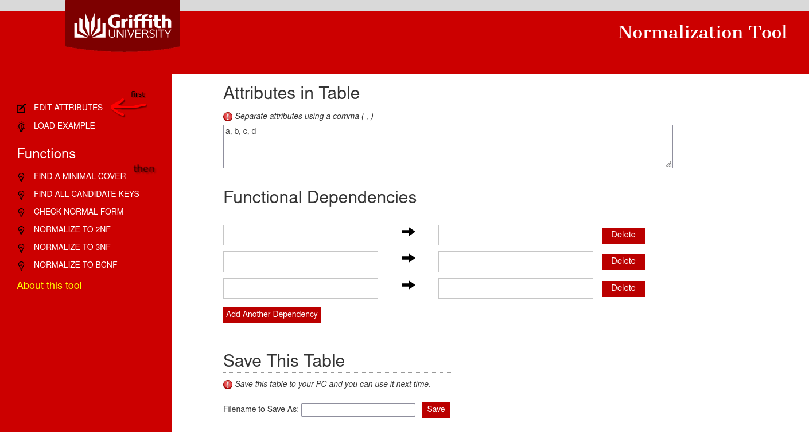

# Basi di Dati

## PDF, MD e appunti sfusi

- Esercizi (svolti e non) di algebra relazionale. [clicca qui](./MDs/algebra-relazionale.md)
- BCNF, come si fa ed esempio di applicazione. [clicca qui](./PDFs/BCNF%20con%20esempio.pdf)
- Come valutare le ridondanze all'interno di un database. [clicca qui](./PDFs/Valutare_ridondanze_con_esempio.pdf)

## Link Utili

### Tools

- **Per disegnare diagrammi** ER e progettare database.

https://app.diagrams.net/

- **Convertire codice SQL in diagrammi UML**.
### Video

Per aprire un video, clicka sulla rispettiva anteprima.

- **ACID Properties in Databases With Examples**

- **1NF/2NF to 3NF Conversion | How To Decompose A Relation With Example | DBMS Session 34**

- **testing conflict serialisability using precedence graph, transaction management, DBMS**

### Forum online
- **Swappa**. *"Swappa è un wiki creato e pensato (in quest'ordine) da e per gli studenti del Dipartimento di Tecnologie dell'Informazione dell'Università di Crema. Il suo obiettivo principale è formare una comunità virtuale di studenti che condividono pensieri, idee, appunti e le suppliche più efficaci per superare gli esami."*. Nonostante gli appunti siano datati 2010 (anno più anno meno), risultano ancora molto esplicativi e tanto affini agli argomenti trattati nel corso unict. http://www.swappa.it

    - Serializzabilità di una schedule, view equivalenza, conflict-equivalenza (VSR e CSR), 2 phase locking. 
    http://www.swappa.it/wiki/Uni/BDC-Serializzabilit%E0
    - Esercizi sullo scheduling. http://www.swappa.it/wiki/Uni/BDCexSchedule
    - XQuery. http://www.swappa.it/wiki/Uni/BDC-XQuery

### Calcolatori

- **Calcolatore di algebra relazionale**.

https://dbis-uibk.github.io/relax/landing

- **Calcolatore di forme normali** (1NF, 2NF, 3NF, BCNF), **copertura minimale** e chiavi primarie.

https://www.ict.griffith.edu.au/normalization_tools/normalization/ind.php

- **Calcolatore di forme normali** - Alternativa validissima.

https://kitsugo.com/tool/database-normalizer/

